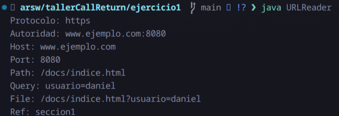
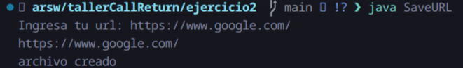
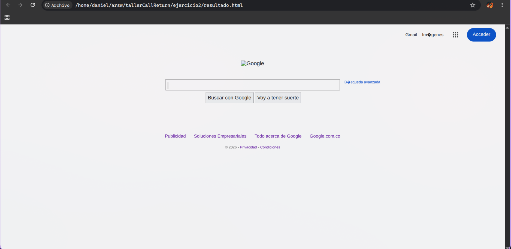

# tallerCallReturn

* Daniel Alexander Ahumada León

---

## Ejercicio 1

Para el primer ejercicio tenemos lo que es un programa que toma una URL y nos devuelve los datos de esta para ellos usamos esta URL de ejemplo:

```
https://www.ejemplo.com:8080/docs/indice.html?usuario=daniel#seccion1

```

Y ya la salida se ve de la siguiente manera



---

## Ejercicio 2

Para el ejercicio 2 se tomo la estructura que teniamos en el ejercicio 1, se utilizo scanner para tomar la lectura de la url, y luego lo que hicimos fue usar PrintWriter para sobreescribir un archivo resultado.html



Ya luego tenemos dentro de nuestro mismo directorio un archivo html el cual podemos abrir en el navegador, por ejemplo este de google

