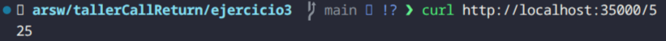

# tallerCallReturn

* Daniel Alexander Ahumada León

---

## Ejercicio 1

Para el primer ejercicio tenemos lo que es un programa que toma una URL y nos devuelve los datos de esta para ellos usamos esta URL de ejemplo:

```
https://www.ejemplo.com:8080/docs/indice.html?usuario=daniel#seccion1

```

Y ya la salida se ve de la siguiente manera


---

## Ejercicio 2

Para el ejercicio 2 se tomo la estructura que teniamos en el ejercicio 1, se utilizo scanner para tomar la lectura de la url, y luego lo que hicimos fue usar PrintWriter para sobreescribir un archivo resultado.html


Ya luego tenemos dentro de nuestro mismo directorio un archivo html el cual podemos abrir en el navegador, por ejemplo este de google


---

## Ejercicio 3

Para este ejercicio lo que se hizo es solo crear un servidor el cual tomaba un numero y nos retornaba el cuadrado de este. Basicamente toma la peticion y la direccion del recurso es el numero a calcular



---

## Ejercicio 4

---

## Cómo ejecutar los ejercicios

Cada ejercicio se encuentra en su respectiva carpeta y puede ser ejecutado de la siguiente manera:

### Ejercicio 1: URLReader
```bash
javac ejercicio1/URLReader.java
java -cp ejercicio1 URLReader
```

### Ejercicio 2: SaveURL
```bash
javac ejercicio2/SaveURL.java
java -cp ejercicio2 SaveURL
```

### Ejercicio 3: EchoServer
```bash
javac ejercicio3/EchoServer.java
java -cp ejercicio3 EchoServer
```

### Ejercicio 4: CalculatorServer
```bash
javac ejercicio4/CalculatorServer.java
java -cp ejercicio4 CalculatorServer
```

